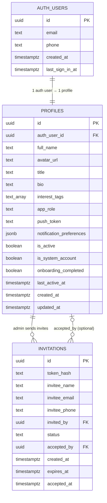
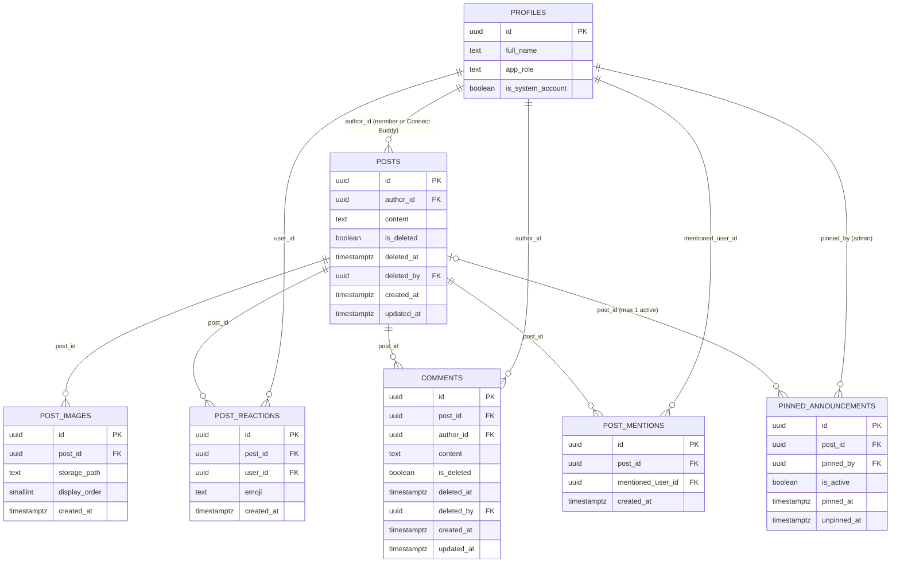
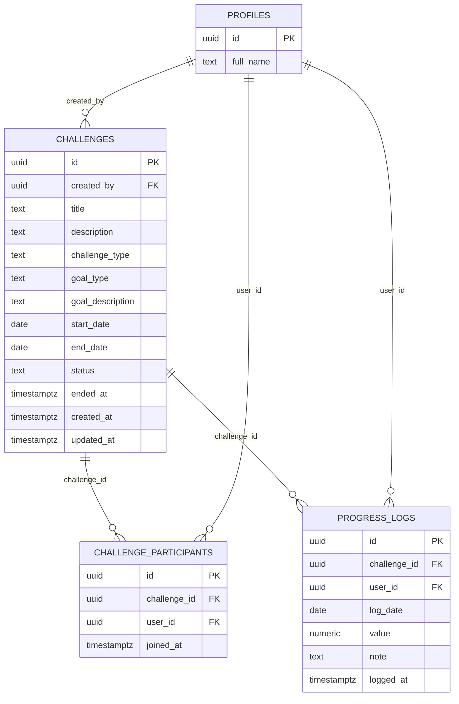
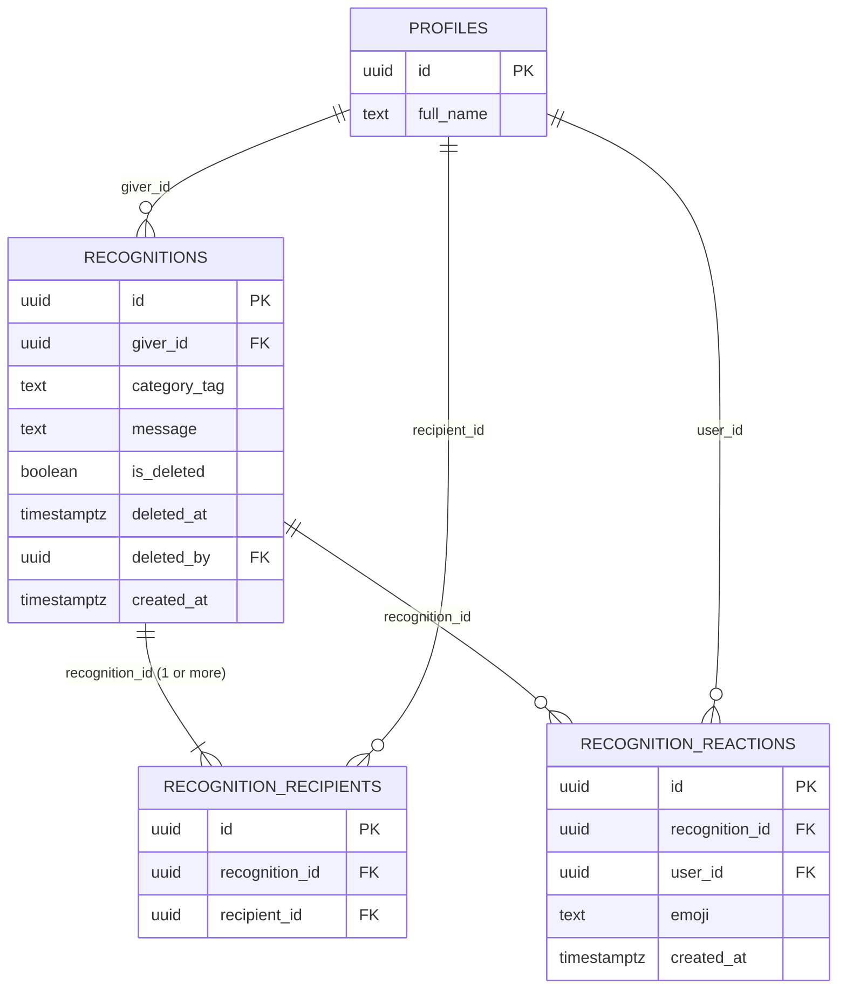
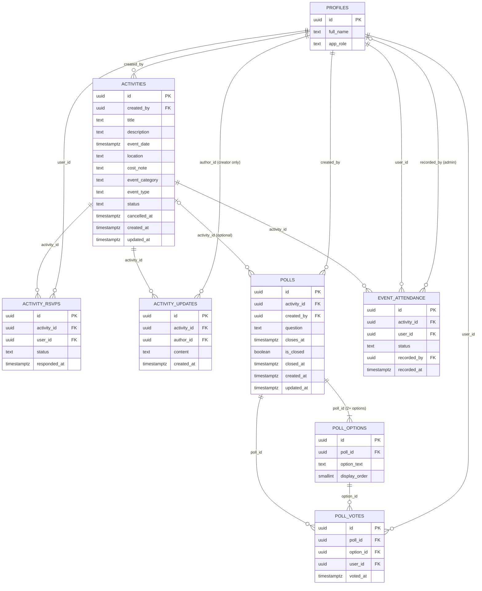
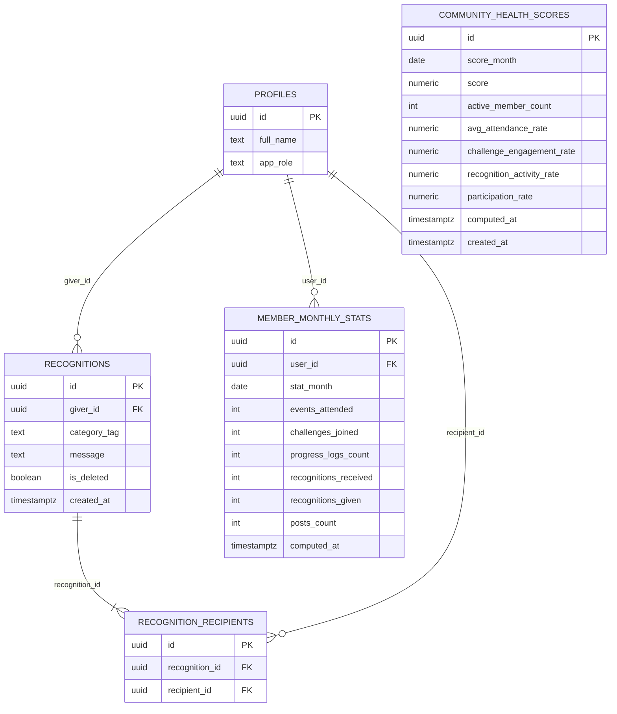
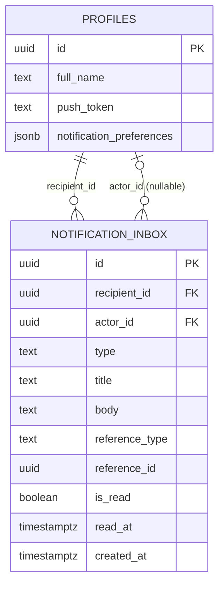
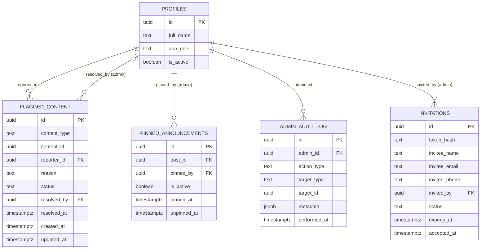
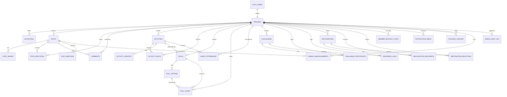

# Database ER Diagrams

## Overview

This document contains Entity-Relationship diagrams for Manager Connect's database. Diagrams are organized by domain for readability. All diagrams use Mermaid ERD notation.

**Reading the diagrams:**
- `||--||` one-to-one (exactly one on each side)
- `||--o{` one-to-many (exactly one on left, zero or more on right)
- `||--|{` one-to-many (exactly one on left, one or more on right)
- `}o--o{` many-to-many (via junction table)

---

## Diagram 1: Identity and Authentication

The foundation layer. Every other domain references `profiles`.

---

## Diagram 2: Community Feed

Posts, images, reactions, comments, and mentions. Connect Buddy posts are authored by the system profile and appear in the same `posts` table.

---

## Diagram 3: Growth Challenges

Challenge lifecycle, participation, and progress tracking.

---

## Diagram 4: Recognition Wall

Peer shout-outs with multiple recipients and reactions. Recognition tables form their own domain layer (Layer 5: Recognition).

---

## Diagram 5: Events — Activities, Polls, and Attendance

Games, outings, social connect events — with RSVP, organizer updates, community polls, and post-event attendance recording.

---

## Diagram 6: Analytics — Monthly Stats and Health Scores

Pre-computed monthly member stats and community health scores that power the Analytics module. Recognition data that feeds into analytics is defined in Diagram 4 (Recognition domain).

---

## Diagram 7: Notifications

In-app notification inbox fed by server-side dispatch.

---

## Diagram 8: Admin and Moderation

Flags, pinned posts, invitations, and the audit log.

---

## Diagram 9: Complete System Overview

Simplified overview showing all entities and their cross-domain relationships. Column details omitted for readability.

---

## Key Design Observations

### Cross-Domain Profile References
`profiles` is the central hub entity. Every domain table that involves a user action references `profiles.id`. The design avoids embedding user data in domain tables — all user display data is fetched via join with `profiles`. The Connect Buddy system account is a row in `profiles` with `is_system_account = true`, making its posts structurally identical to member posts.

### Two-Table Pattern for Multi-Recipients
Recognition uses a junction table (`recognition_recipients`) rather than an array column to store multiple recipients. This enables:
- Standard FK constraints
- Efficient query: "show all recognitions where I am a recipient"
- Clean RLS (filter by `recipient_id`)
- Future extensibility (add received_at, acknowledged, etc.)

### Soft Delete Chain
Content that can be moderated follows a consistent pattern:
`is_deleted (bool)` + `deleted_at (timestamptz)` + `deleted_by (uuid FK → profiles.id)`
This applies to: posts, comments, recognitions. Anonymization (not deletion) applies to user PII in profiles.

### Poll Design: Standalone and Activity-Linked
The `polls` table has a nullable `activity_id` FK. This allows polls to exist independently (community standalone polls) or be tied to a specific event (e.g., "Vote on the next cricket team format"). The `poll_votes` UNIQUE constraint on `(poll_id, user_id)` guarantees one vote per member per poll at the database level.

### Analytics Computation Pattern
`member_monthly_stats` and `community_health_scores` are computed tables — their data is derived from source tables (`event_attendance`, `progress_logs`, `recognitions`, `posts`, `challenge_participants`) by the `compute-monthly-stats` scheduled Edge Function. This avoids expensive aggregate queries at read time for the Analytics screens.

### Leaderboard Query Pattern
The in-challenge leaderboard is computed on query — no denormalized totals are stored. For 20–100 users it is a lightweight `SUM(value) GROUP BY user_id ORDER BY total DESC` on `progress_logs`. All-time rankings across months use `member_monthly_stats` for efficiency. If scale increases further, a materialized view can be added without changing the base schema.

### event_category and event_type Pattern
The `activities` table uses a two-column categorization: `event_category` (high-level: games/outings/social_connect) and `event_type` (specific: cricket/lunch_meetup/etc.). This enables both broad filtering (show all games) and specific filtering (show all cricket events) from a single indexed query without complex joins.
