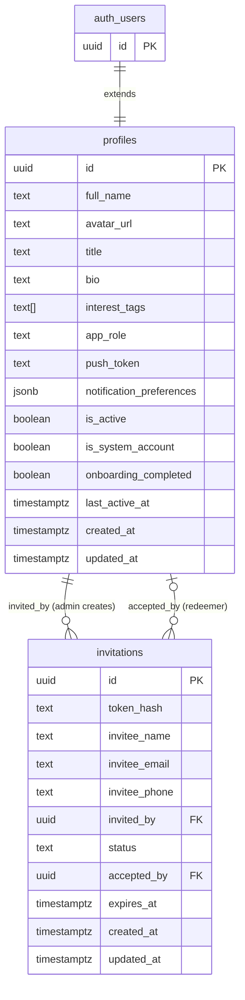
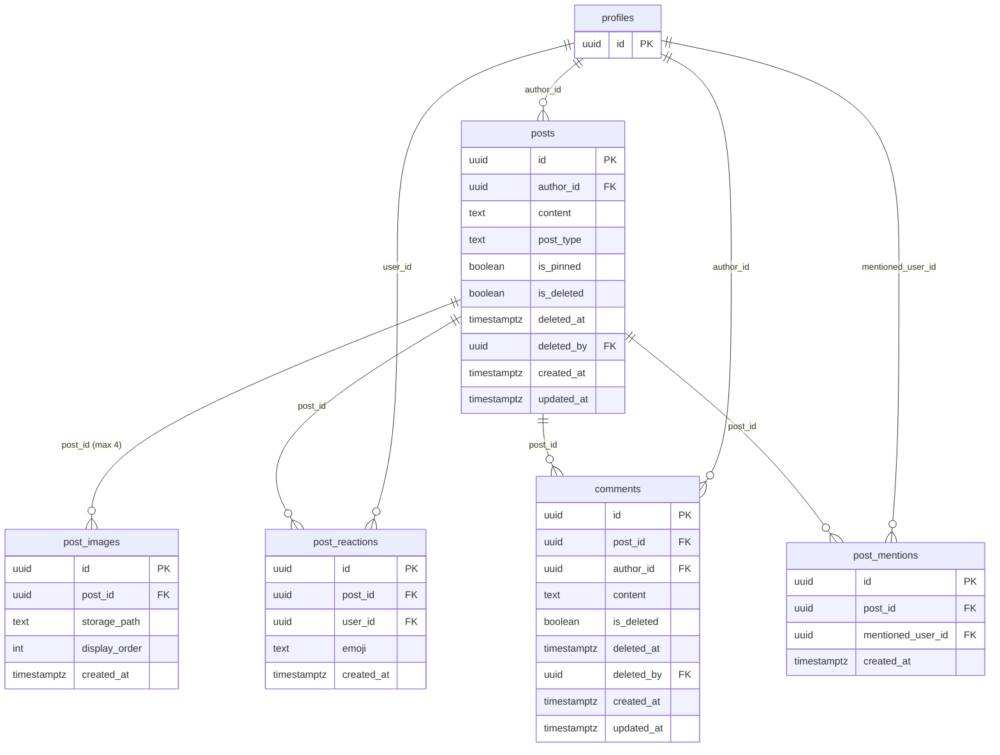
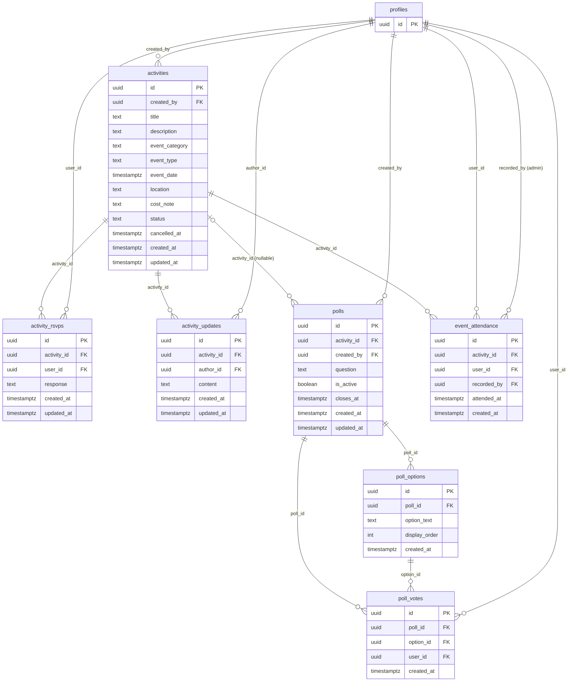
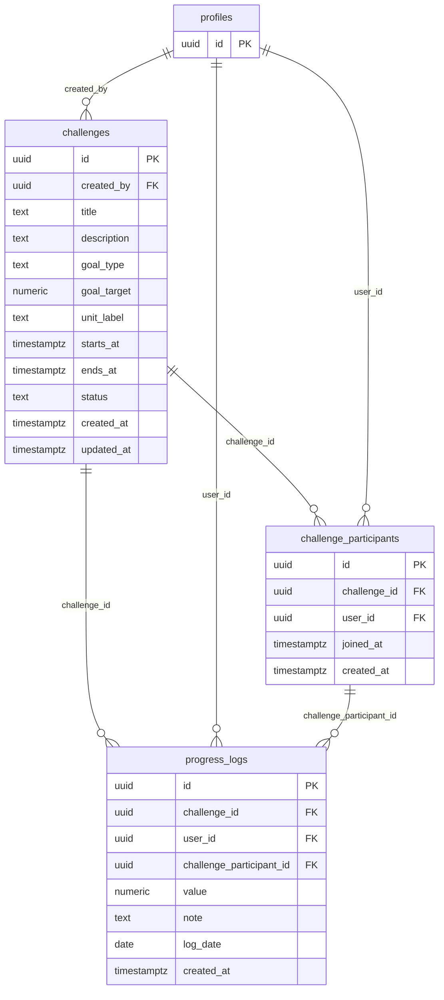
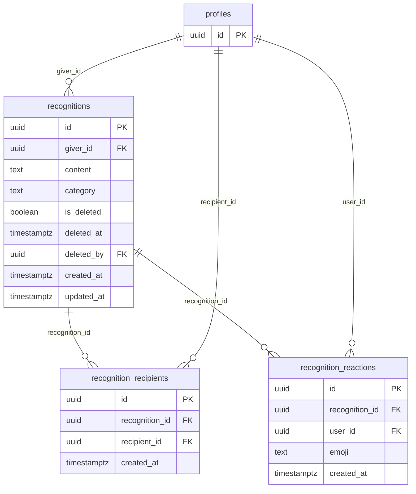
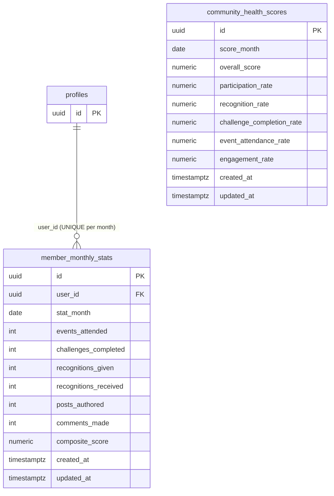
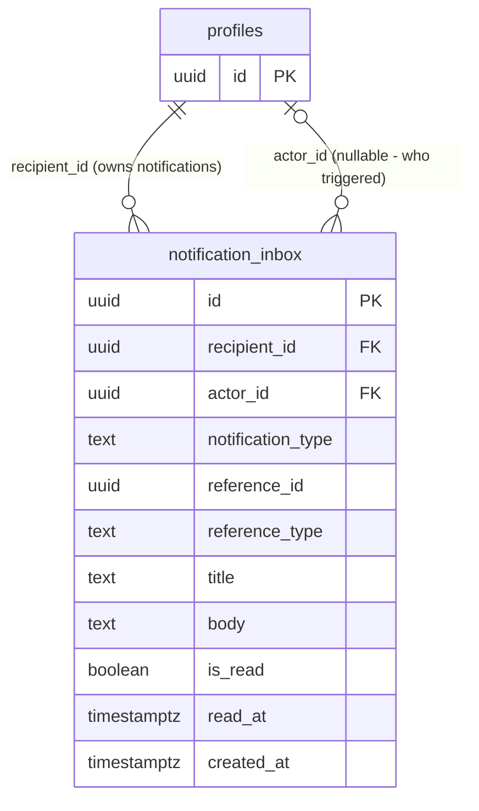
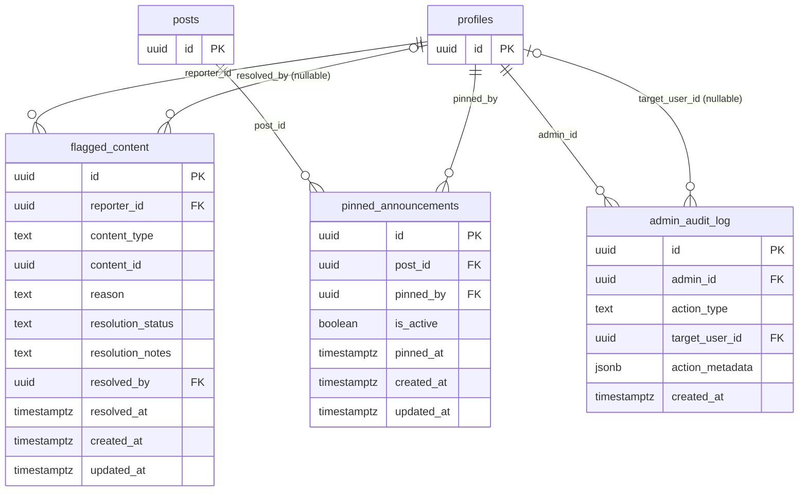

# Database Relationships

This document describes the entity relationships across all 26 tables in the Manager Connect PostgreSQL database. It covers cardinality, foreign key semantics, Mermaid ER diagrams per domain layer, cross-domain relationships, and special relationship patterns (polymorphic references, soft deletes, immutable tables).

---

## Overview

The Manager Connect schema follows a hub-and-satellite model. The `profiles` table is the central hub — nearly every table in every domain holds a foreign key back to `profiles.id`, representing the acting or affected user. Content tables (posts, activities, challenges, recognitions) are primary satellites, each with their own child tables for reactions, participants, and sub-resources. Analytics tables sit at the outer edge as computed aggregates with no children of their own.

Three relationship patterns appear repeatedly:
1. **Author/Owner pattern** — a `user_id` or `author_id` column points back to `profiles.id`, establishing who created or owns the row.
2. **Junction/Participation pattern** — a table with two FK columns and a UNIQUE constraint on both, representing M:N membership (e.g., `challenge_participants`, `poll_votes`).
3. **Polymorphic soft FK pattern** — a `content_id` or `reference_id` column that can reference one of several parent tables, with no database-level FK constraint (e.g., `flagged_content.content_id`, `notification_inbox.reference_id` with `reference_type` discriminator).

---

## Cardinality Reference Table

| Parent Table | Child Table | Relationship | Join Column(s) | ON DELETE | Notes |
|---|---|---|---|---|---|
| `auth.users` | `profiles` | 1:1 | `profiles.id` | — (Supabase manages) | profiles.id mirrors auth.users.id |
| `profiles` | `invitations` (invited_by) | 1:M | `invitations.invited_by` | — | Admin creates many invites |
| `profiles` | `invitations` (accepted_by) | 1:1 | `invitations.accepted_by` | — | Null until redeemed |
| `profiles` | `posts` | 1:M | `posts.author_id` | RESTRICT | Author must exist |
| `posts` | `post_images` | 1:M | `post_images.post_id` | CASCADE | Images deleted with post |
| `posts` | `post_reactions` | 1:M | `post_reactions.post_id` | CASCADE | Reactions deleted with post |
| `profiles` | `post_reactions` | 1:M | `post_reactions.user_id` | CASCADE | Reactions removed if user deleted |
| `posts` | `comments` | 1:M | `comments.post_id` | CASCADE | Comments deleted with post |
| `profiles` | `comments` | 1:M | `comments.author_id` | RESTRICT | Author must exist |
| `posts` | `post_mentions` | 1:M | `post_mentions.post_id` | CASCADE | Mentions deleted with post |
| `profiles` | `post_mentions` | 1:M | `post_mentions.mentioned_user_id` | CASCADE | Mention removed if user deleted |
| `profiles` | `activities` | 1:M | `activities.created_by` | RESTRICT | Creator must exist |
| `activities` | `activity_rsvps` | 1:M | `activity_rsvps.activity_id` | CASCADE | RSVPs deleted with activity |
| `profiles` | `activity_rsvps` | 1:M | `activity_rsvps.user_id` | CASCADE | RSVPs removed if user deleted |
| `activities` | `activity_updates` | 1:M | `activity_updates.activity_id` | CASCADE | Updates deleted with activity |
| `profiles` | `activity_updates` | 1:M | `activity_updates.author_id` | RESTRICT | Author must exist |
| `activities` | `polls` | 1:M | `polls.activity_id` | SET NULL | Poll survives activity deletion; nullable |
| `profiles` | `polls` | 1:M | `polls.created_by` | RESTRICT | Creator must exist |
| `polls` | `poll_options` | 1:M | `poll_options.poll_id` | CASCADE | Options deleted with poll |
| `polls` | `poll_votes` | 1:M | `poll_votes.poll_id` | CASCADE | Votes deleted with poll |
| `poll_options` | `poll_votes` | 1:M | `poll_votes.option_id` | CASCADE | Vote deleted if option deleted |
| `profiles` | `poll_votes` | 1:M | `poll_votes.user_id` | CASCADE | Votes removed if user deleted |
| `activities` | `event_attendance` | 1:M | `event_attendance.activity_id` | CASCADE | Attendance records deleted with activity |
| `profiles` | `event_attendance` (user) | 1:M | `event_attendance.user_id` | CASCADE | Record removed if user deleted |
| `profiles` | `event_attendance` (recorded_by) | 1:M | `event_attendance.recorded_by` | RESTRICT | Recording admin must exist |
| `profiles` | `challenges` | 1:M | `challenges.created_by` | RESTRICT | Creator must exist |
| `challenges` | `challenge_participants` | 1:M | `challenge_participants.challenge_id` | CASCADE | Participants deleted with challenge |
| `profiles` | `challenge_participants` | 1:M | `challenge_participants.user_id` | CASCADE | Membership removed if user deleted |
| `challenges` | `progress_logs` | 1:M | `progress_logs.challenge_id` | CASCADE | Logs deleted with challenge |
| `profiles` | `progress_logs` | 1:M | `progress_logs.user_id` | CASCADE | Logs removed if user deleted |
| `challenge_participants` | `progress_logs` | 1:M | `progress_logs.challenge_participant_id` | CASCADE | Logs deleted when participant row deleted |
| `profiles` | `recognitions` | 1:M | `recognitions.giver_id` | RESTRICT | Giver must exist |
| `recognitions` | `recognition_recipients` | 1:M | `recognition_recipients.recognition_id` | CASCADE | Recipients deleted with recognition |
| `profiles` | `recognition_recipients` | 1:M | `recognition_recipients.recipient_id` | CASCADE | Recipient row removed if user deleted |
| `recognitions` | `recognition_reactions` | 1:M | `recognition_reactions.recognition_id` | CASCADE | Reactions deleted with recognition |
| `profiles` | `recognition_reactions` | 1:M | `recognition_reactions.user_id` | CASCADE | Reactions removed if user deleted |
| `profiles` | `member_monthly_stats` | 1:M | `member_monthly_stats.user_id` | CASCADE | Stats removed if user deleted |
| `profiles` | `notification_inbox` (recipient) | 1:M | `notification_inbox.recipient_id` | CASCADE | Notifications removed if user deleted |
| `profiles` | `notification_inbox` (actor) | 1:M | `notification_inbox.actor_id` | SET NULL | Notification preserved; actor nulled if user deleted |
| `profiles` | `flagged_content` (reporter) | 1:M | `flagged_content.reporter_id` | RESTRICT | Reporter must exist |
| `profiles` | `flagged_content` (resolved_by) | 1:M | `flagged_content.resolved_by` | SET NULL | Flag preserved; resolver nulled if user deleted |
| `posts` | `pinned_announcements` | 1:M | `pinned_announcements.post_id` | RESTRICT | Post must exist to pin |
| `profiles` | `pinned_announcements` | 1:M | `pinned_announcements.pinned_by` | RESTRICT | Admin must exist |
| `profiles` | `admin_audit_log` (admin) | 1:M | `admin_audit_log.admin_id` | RESTRICT | Admin must exist |
| `profiles` | `admin_audit_log` (target) | 1:M | `admin_audit_log.target_user_id` | SET NULL | Log preserved; target nulled if user deleted |

---

## ER Diagrams by Domain Layer

### Identity Layer

### Feed Layer

### Events Layer

### Growth Layer

### Recognition Layer

### Analytics Layer

*`community_health_scores` has no FK to profiles — it is a community-level aggregate computed across all members, not tied to any individual.*

### Notifications Layer

*`notification_inbox.reference_id` is a polymorphic soft FK — it may point to an activity, post, challenge, or recognition depending on `notification_type`. No database-level FK constraint exists on this column.*

### Admin Layer

*`flagged_content.content_id` is a polymorphic soft FK — it points to either a `posts.id` or `comments.id` depending on `content_type`. No database-level FK constraint exists.*

---

## Cross-Domain Relationships

### profiles → All Domains

`profiles` is the only table that is referenced by every other domain. It is the identity anchor for the entire system. Every user action in every domain — posting, RSVPing, voting, logging progress, giving recognition, viewing analytics — creates a row with a FK back to `profiles.id`. This design means that any query involving a user (past or present) can be traced back to a single canonical identity record.

The Connect Buddy system account (`is_system_account = true`, `app_role = 'system'`) is a profile row like any other, allowing CB posts to use the same `posts.author_id` FK without special-casing the schema.

### posts → Admin (Feed → Admin)

`pinned_announcements.post_id` references `posts.id` — a cross-domain FK from the Admin layer into the Feed layer. An admin selects an existing post and promotes it to a pinned announcement; the pin record does not duplicate the post content, it only references it. If the post is soft-deleted, the pin becomes orphaned in terms of content but is preserved in the admin layer for audit purposes (ON DELETE RESTRICT prevents hard deletion of pinned posts without first removing the pin).

### activities → polls / event_attendance (internal Events)

Within the Events domain, `polls` and `event_attendance` both reference `activities`. A poll may be standalone (`activity_id IS NULL`) or tied to a specific event. Event attendance is always tied to an activity. This creates a star pattern within the Events domain where `activities` is the inner hub.

### notification_inbox → Multiple Domains

`notification_inbox.reference_id` is the primary cross-domain polymorphic reference. Depending on `notification_type`, this UUID points to:
- An `activities.id` (for event reminders, cancellations, updates)
- A `posts.id` (for mentions, comments)
- A `challenges.id` (for challenge notifications)
- A `recognitions.id` (for recognition notifications)
- A `poll_options.id` within an event (for poll reminders)

This is documented as a deliberate design decision: the notification system needs to deep-link to content in any domain, and a single polymorphic column with a companion `reference_type` discriminator column is the cleanest way to handle this without adding 5 nullable FK columns.

### flagged_content → Feed (Admin → Feed)

`flagged_content.content_id` references either `posts.id` or `comments.id` in the Feed domain. The `content_type` discriminator column (`'post'` or `'comment'`) tells the application which table to query. This is the only cross-domain polymorphic FK in the schema.

---

## Relationship Narratives by Domain

### Identity

The Identity layer manages who exists in the system and who they are. `profiles` extends Supabase's built-in `auth.users` table with a 1:1 relationship — every authenticated user has exactly one profile, and the profile `id` mirrors the auth UUID exactly. `invitations` creates a controlled entry funnel: an admin creates an invitation row with a hashed token and optional email; when a new user redeems the token during signup, `invitations.used_by` is set to their new profile `id`. An admin may create many invitations (1:M from admin profile to invitations), but each invitation can only be used once (1:1 from invitation to redeemer profile).

### Feed

The Feed layer is the most internally connected domain. `posts` is the root; four tables hang directly off it. `post_images` stores up to 4 image paths per post. `post_reactions` is a junction between posts and profiles with a UNIQUE constraint ensuring one reaction per user per post. `comments` are flat (no threading) — each comment belongs to one post and one author. `post_mentions` records @mention relationships extracted from post content; these drive notifications without requiring the notification system to parse post text at read time.

### Events

`activities` is the root of the Events domain. `activity_rsvps` tracks member attendance intent (UNIQUE per activity+user). `activity_updates` are organizer notes posted to an event thread. `polls` can stand alone or attach to an event — the nullable `activity_id` FK supports both modes. Within a poll, `poll_options` are the answer choices and `poll_votes` is the junction (UNIQUE per poll+user — votes are immutable once cast). `event_attendance` is post-event admin-recorded attendance, distinct from RSVPs (which are pre-event intent).

### Growth

`challenges` are time-bounded fitness or wellness goals created by admins. Members join challenges via `challenge_participants` (UNIQUE per challenge+user). Once joined, members submit `progress_logs` that reference both the challenge and their participant row — this double-FK enables queries like "all logs for this challenge by this participant" without a join through a third table.

### Recognition

`recognitions` is the giver's post (the shout-out). A single recognition can name multiple recipients: `recognition_recipients` is the junction between a recognition and the profiles being recognized. This M:N structure supports team shout-outs. `recognition_reactions` mirrors the post_reactions pattern — members can emoji-react to any recognition (one reaction per user per recognition).

### Analytics

The Analytics domain sits at the read-only edge of the schema. `member_monthly_stats` aggregates per-member engagement data once per month (UNIQUE per user+month). `community_health_scores` aggregates community-wide health metrics once per month (UNIQUE per month). Both tables are written exclusively by Edge Functions (service_role bypasses RLS) and are read-only via normal client access. Neither table has children; they are terminal aggregates.

### Notifications

`notification_inbox` is a single-table domain. Every notification delivered to a user gets one row: who received it (`recipient_id`), who triggered it (`actor_id`, nullable for system-generated notifications), what type it is (`notification_type`), and what content it links to (`reference_id` + `reference_type`). The table is append-only — notifications are never deleted, only marked as read. The polymorphic `reference_id` column is the only cross-domain reference in this table.

### Admin

The Admin layer contains three structurally different tables. `flagged_content` is a moderation queue — members report content, admins resolve it. `pinned_announcements` is a thin overlay on top of Feed posts — an admin pins an existing post, which surfaces it at the top of the Feed. Only one pin can be active at a time (partial UNIQUE index WHERE is_active = true). `admin_audit_log` is an immutable append-only record of every admin action; it has no `updated_at` column and no UPDATE or DELETE RLS policies for any role.

---

## Special Cases

### Polymorphic References

Two columns in the schema use the polymorphic soft-FK pattern — a single `uuid` column that references one of several parent tables depending on a companion discriminator column:

**`flagged_content.content_id`** references either `posts.id` or `comments.id`. The discriminator is `flagged_content.content_type` (`'post'` or `'comment'`). A database-level FK constraint is not possible on a single column that must reference two different tables. Referential integrity is enforced at the application layer (the Edge Function that creates a flag validates the content exists) and administratively (admin-only access means the risk surface is small).

**`notification_inbox.reference_id`** references one of: `activities.id`, `posts.id`, `challenges.id`, `recognitions.id`, or an event poll combination. The discriminator is `notification_inbox.reference_type`. Same rationale — a DB-level FK cannot span multiple tables from one column. Integrity is enforced by the notification-dispatch Edge Function, which creates the `reference_id` from a validated content record at dispatch time.

### Immutable / Append-Only Tables

**`admin_audit_log`** is fully immutable. It has no `updated_at` column and no UPDATE or DELETE RLS policies. Once an admin action is recorded, it cannot be modified or removed by any role via the client. Edge Functions write to it via service_role; that path is controlled and deterministic.

**`notification_inbox`** is append-only for deletion purposes. Notifications are never hard-deleted. They can only be marked as `is_read = true`. This preserves full notification history per member.

**`poll_votes`** is immutable by policy. Once a member casts a vote (INSERT), there are no UPDATE or DELETE policies. Combined with the UNIQUE(poll_id, user_id) constraint, this means votes cannot be changed or retracted.

### Soft Delete Pattern

Three tables — `posts`, `comments`, `recognitions` — use a three-column soft delete pattern instead of hard DELETE:

- `is_deleted` (boolean, default false) — the deletion flag
- `deleted_at` (timestamptz, nullable) — when the deletion occurred
- `deleted_by` (uuid FK → profiles.id) — who performed the deletion (author self-deleting or admin moderating)

Rows with `is_deleted = true` are invisible to member SELECT policies. Admin SELECT policies return all rows including deleted ones (for moderation review). Hard DELETE RLS policies are absent from all three tables — no role can physically remove content rows.

### One-Vote Constraint

`poll_votes` carries UNIQUE(poll_id, user_id). A member can vote only once per poll. There is no way to change a vote (no UPDATE policy). The database constraint is the primary enforcement mechanism; the app layer also prevents re-voting via UI state.

### One-Reaction Constraint

Both `post_reactions` and `recognition_reactions` carry a UNIQUE constraint on (content_id, user_id). A member can hold only one reaction per post or recognition. Changing a reaction requires deleting the existing row and inserting a new one — no UPDATE policy exists on either table.

### Single Active Pin Constraint

`pinned_announcements` uses a partial unique index: UNIQUE on `post_id` WHERE `is_active = true`. This allows multiple historical pin records for the same post (the post could be pinned, unpinned, and pinned again), while ensuring only one post can be the active pin at any given time. When an admin pins a new post, the old active pin is set to `is_active = false` before the new pin row is created.

---

## ON DELETE Cascade Strategy

| FK Relationship | ON DELETE | Rationale |
|---|---|---|
| `profiles.id` → `auth.users.id` | Supabase-managed | Auth deletion is handled at the platform level |
| `posts.author_id` → `profiles.id` | RESTRICT | Authors should be deactivated (is_active=false), not deleted; historical posts must be preserved |
| `post_images.post_id` → `posts.id` | CASCADE | Images have no independent existence; they travel with the post |
| `post_reactions.post_id` → `posts.id` | CASCADE | Reactions belong to the post |
| `post_reactions.user_id` → `profiles.id` | CASCADE | Reactions are ephemeral user expressions |
| `comments.post_id` → `posts.id` | CASCADE | Comments belong to the post |
| `comments.author_id` → `profiles.id` | RESTRICT | Same rationale as posts author |
| `post_mentions.post_id` → `posts.id` | CASCADE | Mentions have no meaning without the parent post |
| `post_mentions.mentioned_user_id` → `profiles.id` | CASCADE | Historical mention is meaningless after profile removal |
| `activities.created_by` → `profiles.id` | RESTRICT | Creator should be deactivated; events must persist |
| `activity_rsvps.activity_id` → `activities.id` | CASCADE | RSVPs have no meaning without the event |
| `activity_rsvps.user_id` → `profiles.id` | CASCADE | RSVP records follow the user |
| `activity_updates.activity_id` → `activities.id` | CASCADE | Updates belong to the activity |
| `polls.activity_id` → `activities.id` | SET NULL | Standalone polls are valid; poll must survive optional event deletion |
| `poll_options.poll_id` → `polls.id` | CASCADE | Options cannot exist without their poll |
| `poll_votes.poll_id` → `polls.id` | CASCADE | Votes cannot exist without their poll |
| `poll_votes.option_id` → `poll_options.id` | CASCADE | Votes cannot exist without a valid option |
| `poll_votes.user_id` → `profiles.id` | CASCADE | Votes follow the user |
| `event_attendance.activity_id` → `activities.id` | CASCADE | Attendance records belong to the activity |
| `event_attendance.user_id` → `profiles.id` | CASCADE | Attendance follows the user |
| `event_attendance.recorded_by` → `profiles.id` | RESTRICT | Recording admin should be deactivated, not deleted |
| `challenges.created_by` → `profiles.id` | RESTRICT | Challenge must persist; creator deactivated |
| `challenge_participants.challenge_id` → `challenges.id` | CASCADE | Participation records belong to the challenge |
| `challenge_participants.user_id` → `profiles.id` | CASCADE | Participation follows the user |
| `progress_logs.challenge_id` → `challenges.id` | CASCADE | Logs belong to the challenge |
| `progress_logs.user_id` → `profiles.id` | CASCADE | Logs follow the user |
| `progress_logs.challenge_participant_id` → `challenge_participants.id` | CASCADE | Log is a child of the participant row |
| `recognitions.giver_id` → `profiles.id` | RESTRICT | Givers should be deactivated; recognition records persist |
| `recognition_recipients.recognition_id` → `recognitions.id` | CASCADE | Recipients are part of the recognition |
| `recognition_recipients.recipient_id` → `profiles.id` | CASCADE | Recipient link follows the user |
| `recognition_reactions.recognition_id` → `recognitions.id` | CASCADE | Reactions belong to the recognition |
| `recognition_reactions.user_id` → `profiles.id` | CASCADE | Reactions follow the user |
| `member_monthly_stats.user_id` → `profiles.id` | CASCADE | Stats belong to the user |
| `notification_inbox.recipient_id` → `profiles.id` | CASCADE | Notifications belong to the recipient |
| `notification_inbox.actor_id` → `profiles.id` | SET NULL | Notification preserved; actor reference nulled if user removed |
| `flagged_content.reporter_id` → `profiles.id` | RESTRICT | Reporter should be deactivated, not deleted; flag preserved |
| `flagged_content.resolved_by` → `profiles.id` | SET NULL | Flag preserved; resolver nulled if admin removed |
| `pinned_announcements.post_id` → `posts.id` | RESTRICT | Cannot delete a pinned post without unpinning first |
| `pinned_announcements.pinned_by` → `profiles.id` | RESTRICT | Pinning admin must be deactivated, not deleted |
| `admin_audit_log.admin_id` → `profiles.id` | RESTRICT | Audit log is immutable; admin must be deactivated |
| `admin_audit_log.target_user_id` → `profiles.id` | SET NULL | Log preserved; target reference nulled if user removed |

**RESTRICT rationale:** Used when deleting the parent would create orphaned or misleading data. In this schema, profiles are never hard-deleted — they are deactivated. RESTRICT serves as a safety net that prevents accidental hard deletion of profiles that have authored content.

**CASCADE rationale:** Used when child rows have no independent meaning without the parent. Reactions, RSVP records, and vote records are clear examples — they exist only in the context of their parent content.

**SET NULL rationale:** Used when the child row should survive the parent's deletion but the reference should become undefined. Notification actor references and audit log target references are examples — the historical record matters, but the pointer to a deleted user is set to null rather than causing a constraint violation.
